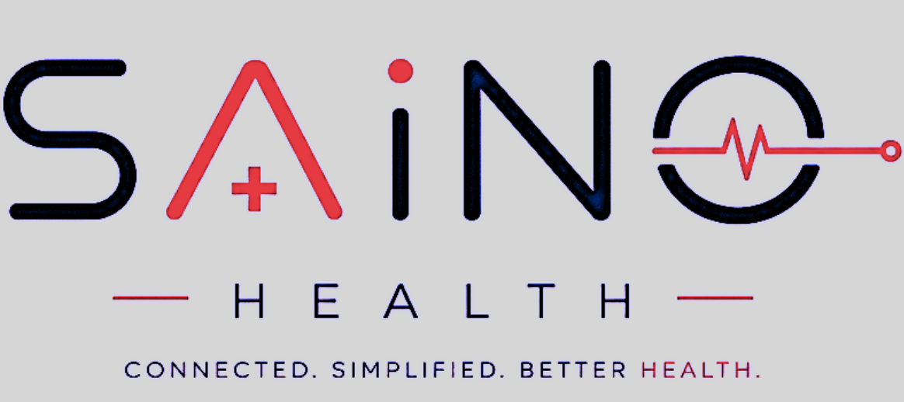

# SAINO HEALTH - Connected Healthcare Marketplace (Nepal)

<div align="center">
  
  
  <p align="center">
    <strong>CONNECTED. SIMPLIFIED. BETTER HEALTH.</strong><br>
    <em>Nepal’s Unified Healthcare Discovery, Provider Verification & Instant Appointment Booking Platform</em>
  </p>

  <p align="center">
    
    
    
    
    
  </p>
</div>

---

## 📖 About SAINO HEALTH

**SAINO HEALTH** (*Saino Tech Ventures Pvt. Ltd.*, Kathmandu, Nepal) is a modern, responsive Single Page Web Application (SPA) designed to connect patients, doctors, hospitals, clinics, diagnostic centers, and health insurance providers across Nepal into a single, high-trust ecosystem.

> **"SEARCH, DISCOVER, REVIEW and BOOK YOUR APPOINTMENT"**  
> *(Connect · Trust · Transparency · Choice)*

---

## 🌟 Key Platform Features

### 1. 🔍 4-Step Patient Journey
- **`01 Search`**: Multi-parameter search by location, medical specialty, doctor name, and hospital.
- **`02 Discover`**: Browse 25+ verified hospitals, clinics, 3.0T MRI diagnostics, 24/7 blood banks, and homecare nursing agencies across Kathmandu Valley, Pokhara, Chitwan, and Biratnagar.
- **`03 Compare`**: Transparent consultation fees, doctor OPD schedules, verified patient reviews, and facility accreditation.
- **`04 Connect`**: 1-click **Direct WhatsApp Appointment Dispatch** with pre-filled patient triage details.

---

### 2. 🏥 "Built to Host Every Part of Your Healthcare Ecosystem" (`List my Care`)
Dedicated healthcare provider onboarding and business growth suite based on the official 8-page specification:
- **9 Core Healthcare Categories**:
  1. *Healthcare Facilities* (Hospitals, Nursing Homes, Specialty Centers)
  2. *Healthcare Professionals* (Consultants, Surgeons, Dentists, General Practitioners)
  3. *Diagnostics & Medical Services* (Pathology Labs, 3.0T MRI, CT Scans, Ultrasound)
  4. *Online Medical Retail* (Verified Pharmacies, Surgical & Medical Supplies)
  5. *Healthcare at Home* (Bedside Nursing, Elderly Care, Post-Op Rehabilitation)
  6. *Healthcare Organizations Campaigns* (Health Drives, Bloodline Networks, Charity Drives)
  7. *Healthcare Awareness* (Preventative Screening, Patient Education Catalogues)
  8. *Wellness Facilities* (Ayurveda, Physiotherapy, Yoga & Mental Wellness)
  9. *Health INSURANCE* (Cashless Mediclaim, Family Health Cover Policies)
- **Interactive DIY Provider Portal**: Instant sign-in, business profile management, reviews reply, and analytics dashboard.
- **Document Compliance Engine**: 200 DPI scan guidelines for legal facility operating licenses, BMW management, Fire Safety NOC, and doctor credentials.

---

### 3. 👑 4-Tier Provider Verification & Subscription Plans
| Tier | Pricing | Key Features |
| :--- | :--- | :--- |
| **SAINO LISTED** | **NPR 0** / Free Forever | 1 Logo upload, 1 photo, 2 bookable services, basic directory listing, manual WhatsApp triage routing. |
| **SAINO PRO** | **NPR 3,600** / month<br>*(NPR 43,200/year)* | ✓ Pro Verified Badge, 5 consultants/packages, 5 photos, full review management, phone display, appointment tools. |
| **SAINO VIP** | **NPR 5,900** / month<br>*(NPR 70,800/year)* | 👑 VIP Verified Badge, 15 consultants/packages, 10 photos, intelligent appointment management, **1 Free Big Screen Campaign / month**. |
| **SAINO HEALTH VVIP** | **NPR 9,999** / month<br>*(NPR 1,19,988/year)* | 🏆 VVIP Advantage, Flagship presence, Healthcare SEO & local optimization, patient interest tracking, **2 Free Big Screen Campaigns / month**. |

---

### 4. 📺 Big Screen Healthcare Campaigns Showcase
- **16:9 Digital Cinema Billboard Display** simulating smart outdoor hospital LED billboards across Nepal.
- **6 Live Verified Mega Campaigns**:
  - *Nepal Red Cross Emergency Bloodline 2026*
  - *Norvic Zero-Wait Cardiac Cath Lab Angioplasty Drive*
  - *Sagarmatha Cashless Family Health Shield*
  - *Annapurna 3.0T High-Precision MRI & Radiology Fast-Track*
  - *Patan LifeCare 24/7 ALS Ventilator Ambulance Fleet*
  - *Everest In-Home Post-Op Nursing & Elderly Care*
- **Display Mode Switcher**: `Digital Billboard (16:9 4K)` | `Spotlight Card` | `App Takeover Screen`.

---

### 5. 🛡️ Data Privacy & 256-Bit SSL Security
- *"Your data has only one owner. YOU."*
- End-to-end encrypted triage routing with zero third-party data sharing.
- Multi-audience contact routing (*Patients, Healthcare Providers, Health Enterprises, Partnerships, Investors*).

---

## 📁 Repository Structure

```
saino-health/
├── index.html            # Primary application shell, top header navbar, search hero & footer
├── assets/
│   └── logo.png          # Official high-resolution SAINO HEALTH brand logo
├── css/
│   └── custom.css        # Verification badges, digital billboard frame, glare, animations
├── js/
│   ├── data.js           # Central database (25 providers, 30 vendor logos, 8 ads, 6 campaigns, 4 tiers)
│   └── app.js            # Reactive router, live multi-filter engine, WhatsApp booking builder, modals
└── README.md             # Complete project documentation & setup guide
```

---

## 💻 Local Quickstart

No build tools or NodeJS required! The application is lightweight and runs directly in any modern browser:

### Option 1: Direct File Open
Simply double-click [`index.html`](index.html) or open it directly in Chrome, Edge, Safari, or Firefox.

### Option 2: Using a Local HTTP Server
If you use VS Code, Python, or Node:

```bash
# Using Python
python -m http.server 8000

# Or using Node / npx
npx serve .
```
Then visit: `http://localhost:8000`

---

## 🚀 How to Push to GitHub & Deploy to GitHub Pages

### Step 1: Initialize Git and Commit
Open PowerShell or Terminal inside this folder (`saino-health`):

```bash
git init
git add .
git commit -m "feat: initial release of SAINO HEALTH marketplace & provider portal"
```

### Step 2: Create a New GitHub Repository & Push
1. Go to [GitHub.com](https://github.com/new) and create a new public repository named `saino-health`.
2. Link your local project to GitHub and push:

```bash
git branch -M main
git remote add origin https://github.com/YOUR_USERNAME/saino-health.git
git push -u origin main
```

### Step 3: Enable Free 1-Click Hosting on GitHub Pages
1. On your GitHub repository page, click **Settings** (⚙️).
2. On the left sidebar, click **Pages**.
3. Under **Build and deployment > Branch**, select `main` and root `/`, then click **Save**.
4. Within 1–2 minutes, your website will be **LIVE on the internet** at:
   `https://YOUR_USERNAME.github.io/saino-health/`

---

## 🏢 Corporate & Office Information

- **Company**: SAINO Tech Ventures Pvt. Ltd.
- **Registered Office**: Tejasswee Girls Hostel opp., Suruchi Marg, Kathmandu-31, Kathmandu 44600, Nepal.
- **Support Email**: support@sainotechventures.com
- **Copyright**: © 2026 All Rights Reserved · SAINO Tech Ventures Pvt. Ltd.

